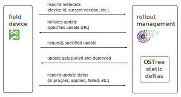

## OSTree (getting the true idea what OSTree updater is about?!)

OSTree is yet another update management system, which very much differs from apt.

### OSTree updates and rollback
https://www.apertis.org/guides/ostree/

#### The differences between apt and OSTree updaters

With the 18.03 release of Apertis, a new set of images have appeared. Apertis is
now delivered in two variants: apt images and OSTree images.

OSTree provides Apertis with an atomic update solution, which is able to work in
containers and flash-specific file systems like UBIFS. OSTree uses an efficient
mechanism to package updates, thus resulting in small downloads.

The standard images are a debian derivative. The OSTree images are prefixed
apertis_ostree. There is no OSTree images for the SDK. The SDK includes a tool
for creating or manipulating OSTree repositories, but it is not using OSTree as
a way to update itself. Only OSTree specific images will support OSTree commands
for updates and rollback. Note that apt-get and the debian packages are not
available in OSTree images.

Another differences TBD (To Be Determined) later in the game...

#### The optional OSTree-based update mechanism

The optional OSTree-based update mechanism provides an efficient and safe update
facility for the base platform, such that updates can be deployed often with
minimal costs. The guide and demonstration installation of hawkBit providing an
example of how to implement fleet manangement.

hawkBit using OSTree static deltas for OTA update 

Applications can be deployed and updated in application bundles (with a new
Flatpak-based solution on the way) without re-deploying the whole platform,
decoupling the release and update cycle of the base software from that of each
application.

#### Updating the host with Apertis Update Manager (AUM)

AUM has been added into Apertis starting from 18.12. It allows to do automatic
and manual updates. Updates with USB mass storage devices are supported as well.
CLI utility updatectl is aimed to manage the AUM daemon.

AUM logs are available with command (remember, systemd is the part of a system):

	# journalctl --unit apertis-update-manager

#### OTA (Over The Air) update

By default OTA updates are switched off.

To enable OTA updates for one time:

	# gdbus call -y -d org.apertis.ApertisUpdateManager -o / -m org.freedesktop.DBus.Properties.Set org.apertis.ApertisUpdateManager UpdatesFromNetwork "<true>"

To enable OTA updates permanently please add into the configuration file
/etc/apertis-update-manager.ini following:

	[Manager]
	UpdateFromNetwork=true

#### Offline update

Starting from Apertis 18.12 files for offline updates are generated and available
for download (check files with extention “*.delta”).

##### Automatic offline update

It is enough to copy such file to the root of USB mass storage device with special
name static-update.bundle and attach that device into the target system. AUM will
automatically detect the update file and try to use it for the system upgrade.

##### Manual offline update

It is possible to update the system manually from local file with CLI, for instance
to update SabreLite device manually to 18.12 release:

	$ updatectl --apply-static-delta apertis_ostree_18.12-minimal-armhf-mx6qsabrelite_18.12.0.delta

##### Automatic rollback

With 19.03 release Apertis is able to automatically detect the rollback situation
for incorrect upgrade and revert the system to the previous state. More details
are available in manual test of rollback.

#### Updating the host with OSTree tool

##### OTA updates

To trigger an update, it is simply needed to run the update command below and reboot.

	$ sudo ostree admin upgrade

	13 metadata, 16 content objects fetched; 28621 KiB transferred in 16 seconds
	Copying /etc changes: 4 modified, 0 removed, 17 added

	(ostree upgrade:719): OSTree-WARNING **: Couldn't unlink ostree-0-1.conf
	Transaction complete; bootconfig swap: yes deployment count change: 1

##### Locally available deployments

OSTree can show the deployments available. This can be though of as seeing the
branches in a call to git branch. The star symbol (\*) is attached to the commit
currently in use.

Immediately after a call to ostree admin update, the (pending) label is attached
to the commit to use on next boot.

	$ sudo ostree admin status
	  apertis 8d77e30a3ae56f0b0bac2e92dfef17869a1764e65936e2c32cb4791330601836.0 (pending)
	    origin refspec: origin:apertis/18.06/amd64-uefi/minimal
	* apertis 398824a16a766149a9c025311745472739f85d310fd6b1346456050dc112671a.0
	    origin refspec: origin:apertis/18.06/amd64-uefi/minimal

After the reboot, the (rollback) label is attached to the commit that was in use
before the update.

	$ sudo ostree admin status
	* apertis 8d77e30a3ae56f0b0bac2e92dfef17869a1764e65936e2c32cb4791330601836.0
	    origin refspec: origin:apertis/18.06/amd64-uefi/minimal
	  apertis 398824a16a766149a9c025311745472739f85d310fd6b1346456050dc112671a.0 (rollback)
	    origin refspec: origin:apertis/18.06/amd64-uefi/minimal

##### Switching to the previous release

After an update, OSTree kept a reference to the previous release that was deployed.
It is possible to switch to this release by using the commit id that was returned in
a call to ostree admin status (with the .0 extension removed).

	$ sudo ostree admin upgrade --allow-downgrade --deploy-only --override-commit=398824a16a766149a9c025311745472739f85d310fd6b1346456050dc112671a -r

And after reboot, the status is:

	$ sudo ostree admin status
	* apertis 398824a16a766149a9c025311745472739f85d310fd6b1346456050dc112671a.1
	    origin refspec: origin:apertis/18.06/amd64-uefi/minimal
	  apertis 8d77e30a3ae56f0b0bac2e92dfef17869a1764e65936e2c32cb4791330601836.0 (rollback)
	    origin refspec: origin:apertis/18.06/amd64-uefi/minimal

Note how the new commit labelled rollback is now the commit corresponding to the
latest update.

Warning: This is not a real rollback! The worst case where a rollback is needed occurs
when the OS didn’t boot. In this situation, the only component able to handle the
rollback is the bootloader.

##### Temporary modifications on the filesystem

OSTree filesystems are read-only (with the exception of /var and /etc). For development
purposes, it is possible to modify files on the filesystem using a layered approach.
OSTree can create a layered, read-write, filesystem on top of the existing /usr. All
changes on this filesystem will be lost at reboot.

	$ sudo ostree admin unlock

#### References

OSTree reference documentation: https://ostree.readthedocs.io/

AUM repository with detailed documentation: https://gitlab.apertis.org/appfw/apertis-update-manager

QT over the air update, using OSTree: http://doc.qt.io/QtOTA/
