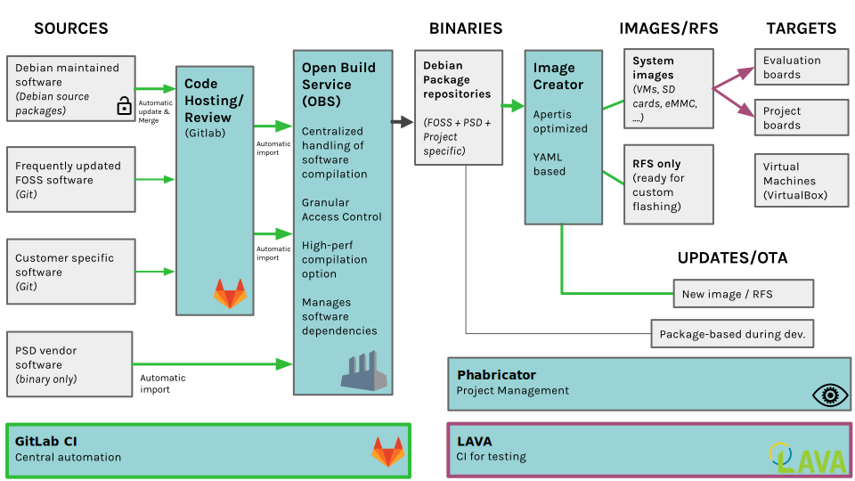
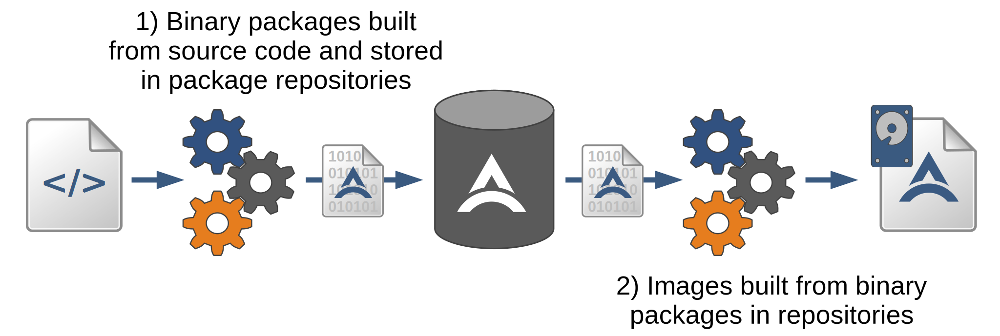

## Apertis (getting the true idea what the beast Apertis is itself?!)

Apertis is a versatile open source distribution and associated infrastructure, originally
tailored to automotive use cases, but which has grown to be a fit for a wide variety of
electronic devices.

This repo is created in attempt to understand the architecture of Apertis. As reading the
initial documents, it seems that Apertis is an FOSS (Free & Open Source Software), which
is similar to the humongous building system, with most of the tools included to generate
.deb packages, as well as to do GitLab CI (Constant Integration) and Testing using LAVA
(Linaro Automated Validation Architecture).

In sone extent there should be a comparison between Apertis and YOCTO (both suppose to
be building systems, whereas Apertis is much more complex than YOCTO).

In nutshell, Yocto is just a small fraction of code in comparison with Apertis!

### Apertis Architecture
https://www.apertis.org/architecture/

### YOCTO building system
https://opensource.com/article/18/6/embedded-linux-build-tools

### The Apertis Platform
https://www.apertis.org/architecture/platform-guide/

#### Package-centric approach

With Apertis, developers can focus on developing the components that provide their unique
experience and rely on the shared core components and infrastructure for everything else.

Apertis builds on the proven practice, used by Debian and many other major distributions,
separating the compilation of individual components into binary packages from the
composition of images destined for target devices. This package-centric approach is the
key enabler at the center of all activities, tools and processes in Apertis. The selection
and selective customization of these binary packages enables deployable images to be
created quickly and efficiently for a variety of different products and product variants
via automated processes.

Basic workflow from source to image

The Apertis infrastructure enables the resources for processes like compilation to be
shared across all users, with changes to common components getting processed once and
resulting binaries being shared with all. These resources are available to every team and
since they are provided as a service they do not need to be duplicated for each developer.
This ensures reproducibility, traceability and consistency during the whole product life
cycle.

#### Key Technologies

Apertis makes heavy use of many open source technologies to form a strong platform:

	- Debian packages provide a wide ecosystem of pre-packaged components, from a
	  project with a long history of providing a reliable, robust operating system.

	- systemd for system and service management, as well providing many basic
	  services.

	- AppArmor adding Mandatory Access Control, providing policy enforcement of
	  applicaiton profiles.

	- OSTree and Flatpak for safe, efficient and modular deployments.

	- D-Bus providing inter-process communications, enabling privilege separation
	  between the various system services and applications.

	- Wayland-based compositor, providing a modern efficient display server.

	- GStreamer enabling multimedia playback.

### The case for moving to Debian stretch or Ubuntu 18.04
https://www.apertis.org/architecture/case-for-moving-to-debian/
